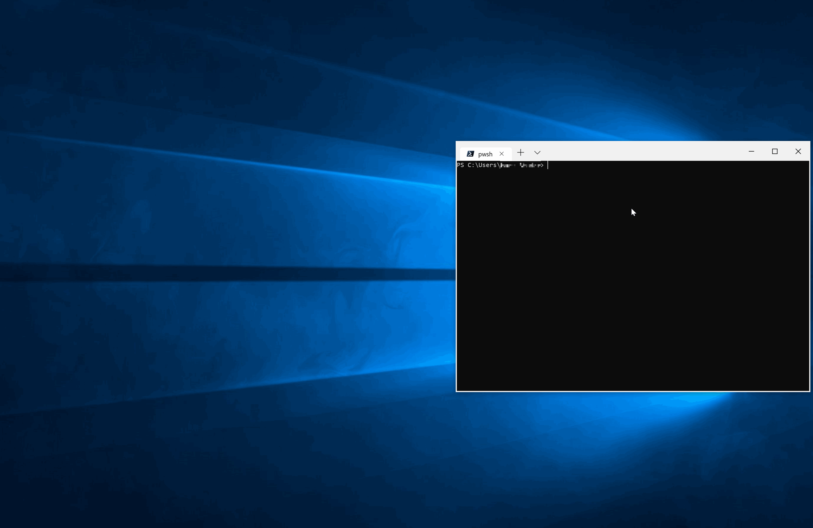

# AWS.SAML
See [PowerShell Gallery](https://www.powershellgallery.com/packages/AWS.SAML) for more information.


## Build Status
|Windows|Linux|macOS|
|---|---|---|
|[](https://beyondcomputing.visualstudio.com/PowerShell%20Modules/_build/latest?definitionId=7&branchName=master)|[](https://beyondcomputing.visualstudio.com/PowerShell%20Modules/_build/latest?definitionId=7&branchName=master)|[](https://beyondcomputing.visualstudio.com/PowerShell%20Modules/_build/latest?definitionId=7&branchName=master)|

## Using The Module
### Installation
Run the following command in an elevated PowerShell session to install the module from the PowerShell Gallery.
```powershell
Install-Module AWS.SAML
```

### How To Login
In a PowerShell window run the following command to authenticate your CLI session with AWS.  On the first run you will be prompted for the SSO Initiation URL.  The Initiation URL is saved in a file in your profile for subsequent uses.
```powershell
Login-AWSSAML
```
#### Using Profiles
In a PowerShell window run the following command to create an AWS profile for use in the CLI.  You can create as many profiles as you want.
```powershell
Login-AWSSAML -ProfileName 'Name'
```

When you need to refresh the credentials for any saved profiles just run the following command.  If you have multiple profiles created it will refresh tokens for all of them unless you specify a profile name.
```powershell
Update-AWSSAMLLogin
```

### SSO Initiation URL
The Initiation URL is the URL that you would login to start the SSO process.  This is the URL provided by your IT team or the first URL that your SSO App Launcher takes you to.

#### Google SSO Initiation URL
Click on the app switcher menu on the top right when logged into a google service.  Scroll down to the AWS option and right click -> "Copy link address".  The address should look similar to the following: `https://accounts.google.com/o/saml2/initsso?idpid=ABC&spid=123&forceauthn=false`.

### CMDLETs
To get more information on each cmdlet run `Get-Help <CMDLET Name>`

#### Authentication CMDLETs
- `Login-AWSSAML`
- `Update-AWSSAMLLogin`

### Browsers
The module can support the following Browsers: Chrome, FireFox, Edge and IE.  Chrome is the default as has been tested.  If you are using another browser and have issues, please report them and preferably submit a PR.

### OS
The module can support running on Linux, macOS and Windows.  However, only Windows has been tested currently.  If you are using another OS and have issues, please report them and preferably submit a PR.  

## Changes
See [CHANGELOG](CHANGELOG.md) for more information.

## Contributing
See [CONTRIBUTING](CONTRIBUTING.md) for more information.

## License
See [LICENSE](LICENSE.md) for more information.